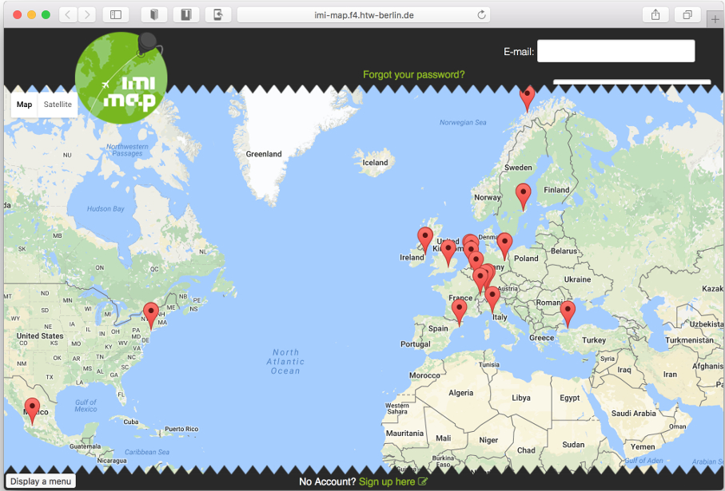

 <small class = "float-right">IMI-Map Screenshot</small>

Die [IMI-Map](https://imi-map.f4.htw-berlin.de/) wurde als Praxisprojekt im Sommersemester 2013 entwickelt.
Sie ist in einen Bereich für Studierende und einen Bereich für die Administration der Praktika aufgeteilt.

Studierenden sollte sie die Möglichkeit bieten, nach vergangengen Praktika zu recherchieren sowie sich
allgemein über das Praktikum im Ausland zu informieren. Dieser Teil wurde leider nicht gepflegt, und
seit einiger Zeit können sich Studierende nicht mehr an der Anwendung anmelden.

Der Administrationsbereich läuft seit jetzt 4 Jahren friedlich und problemlos, und wird vom jeweiligen
Praktikumsbeauftragten und einer studentischen Hilfskraft zur Erfassung und
Nachverfolgung von Praktikumsanträgen und Bearbeitung der Berichte und Zertifikate genutzt.

Im Projekt soll die IMI-Map aktualisiert, repariert und um neue Features erweitert werden.
Damit ist "IMI-Map Reloaded" für die Praxisprojekte insofern untypisch, als daß nicht eine
neue Projektidee auf der grünen Wiese entworfen und umgesetzt wird. Vielmehr
werden Sie sich in vorhandenen Code einarbeiten, diesen zunächst für Sie bearbeitbar machen
und vorhandene Fehler beseitigen - was wohl eher für die meisten realen Projekte
typisch ist. Dafür arbeiten Sie an einem Projekt, das auch nach Semesterende weiter existieren und eingesetzt werden wird.

Je nach Interessenslage und Teamgröße können Sie Erweiterungen
und neue Features insbesondere im Bereich für die Student_innen - rund um Praktikumssuche und Vorbereitung -
entwerfen und umsetzen.

Projektverlauf
- Einarbeitung in Ruby on Rails, automatisches Testen und Deployment
- Erstellen automatischer Tests für die IMI-Map
- Update der Rails-Version
- Restaurierung des Logins/LDAP, Google-Maps-Einbindung
- Festlegen von Erweiterungen im Student_innenbereich sowie Administrationsbereich mit einem User Centered Design Prozess - Umfang je nach Größe und Interesse der Gruppe
- Umsetzung dieser Erweiterungen

# IMI-Website
* [Projektankündigung](https://imi-bachelor.htw-berlin.de/studium/projekte/projekte-im-sommersemester-2017/#c29896)
* [Showtime](https://imi-bachelor.htw-berlin.de/studium/projekte/showtime-im-sommersemester-2017/#c32952)
