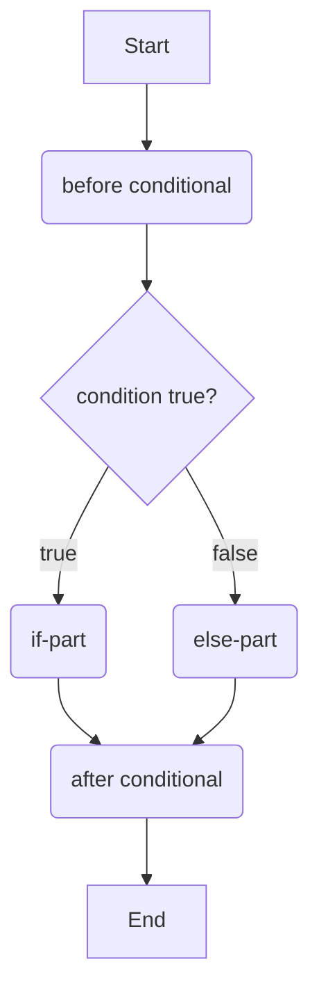
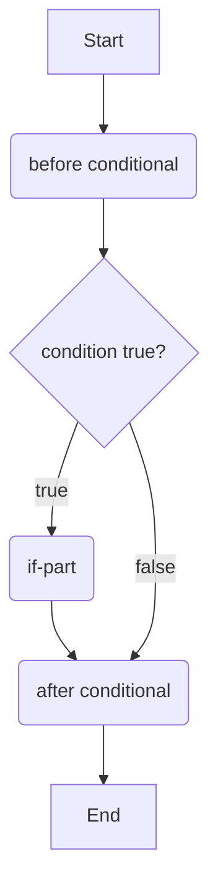
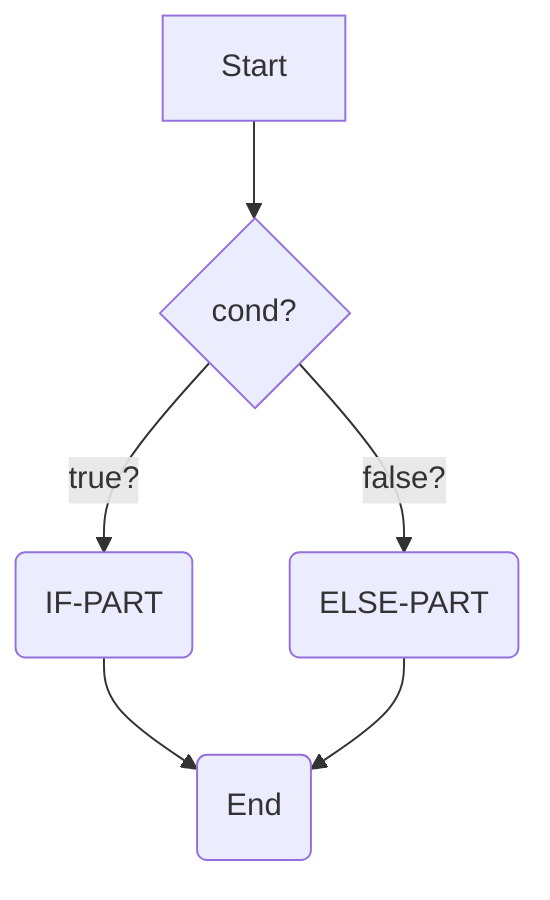
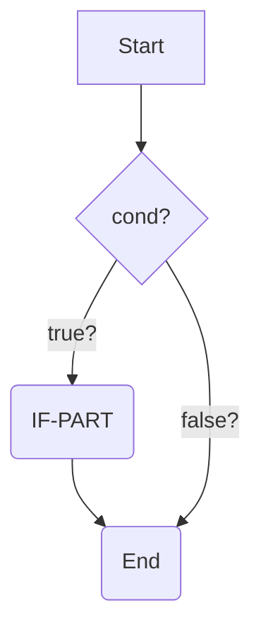

#### Conditional Statement (if-then-else statement)

A conditional statement allows you to conditionally execute code parts based on a condition, either true or false or something that results in true or false (see boolean expression).
# Structure 

```java

// before conditional

if(condition){
    // if-part
} else {
    // else-part
}

// after conditional
```



## The else part can be omitted...
... if you don't need it. If the condition is false, the execution continues directly with the statements after the if-statement.

```java

// before conditional

if(condition){
    // if-part
} 

// after conditional
```




## Examples

#### 1. protective setter: only set field if value is above zero:

```java

public void setPoints(int newPoints){
    if(newPoints >= 0){
        points = newPoints; 
    }
}
```
#### 2. with printing to the command line:
```java
    boolean condition = true; 
    // ...
    System.out.println("before conditional");
    if (condition){
        System.out.println("if-part: condition was true!");
    }
    else {
        System.out.println("else-part: condition was false!");
    }
    System.out.println("after conditional");
    
```

## shorter mermaid if/else




## shorter mermaid if only


## Further Reading

https://docs.oracle.com/javase/tutorial/java/nutsandbolts/if.html