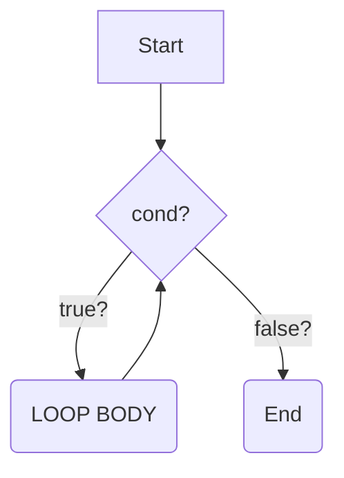
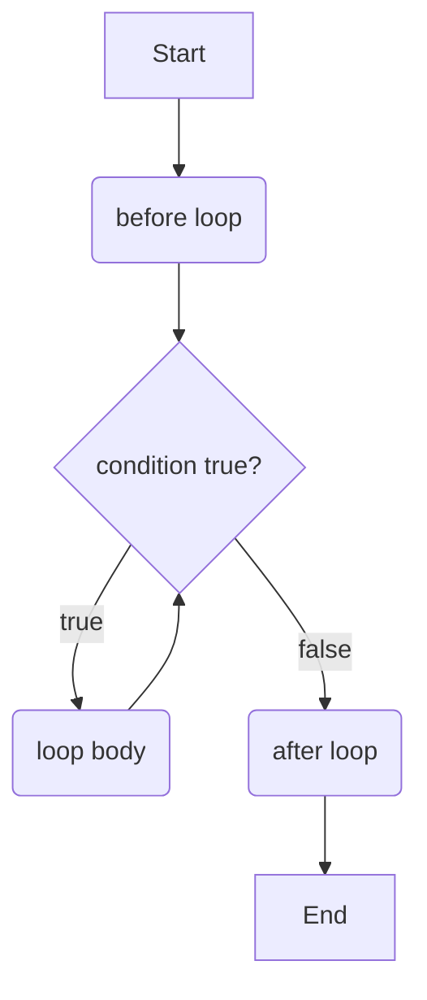

#### While Loop 

# Structure 

```java

// before loop

while(condition){
    // loop body
} 

// after loop
```


# shorter

# longer version



    

```
## Examples

## Further Reading

https://docs.oracle.com/javase/tutorial/java/nutsandbolts/while.html