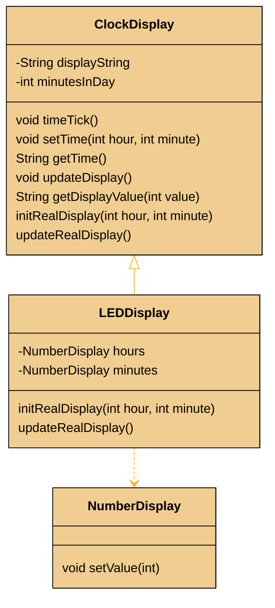
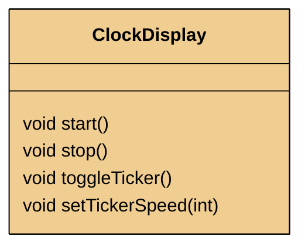
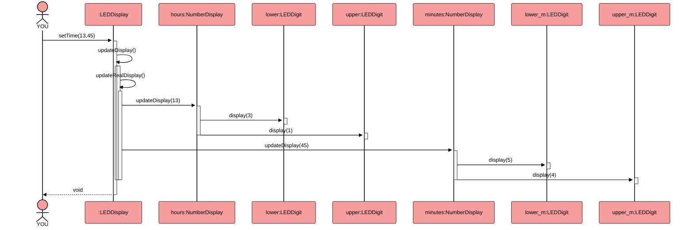
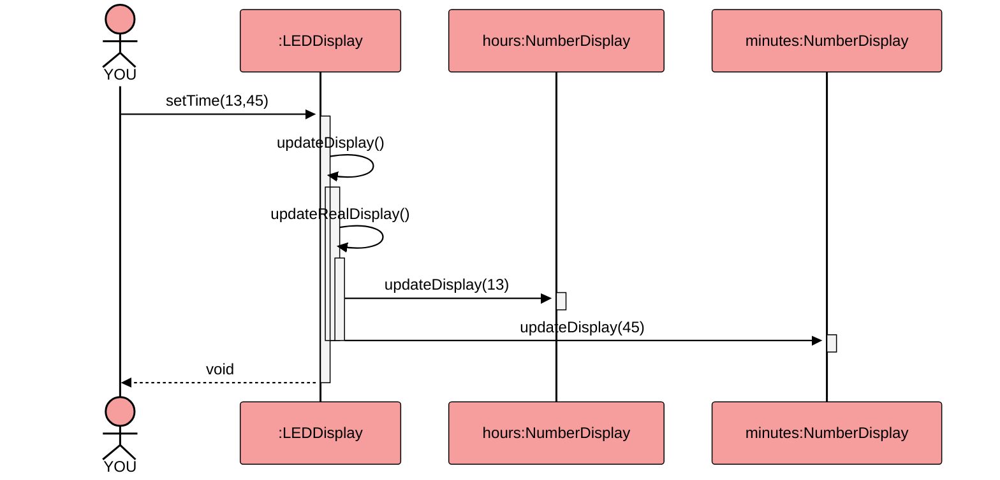
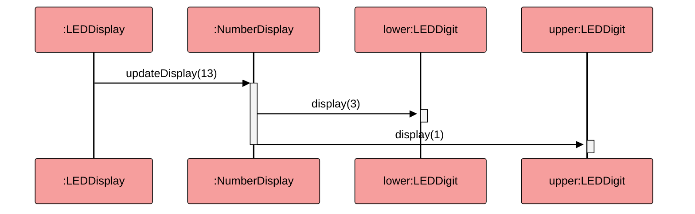
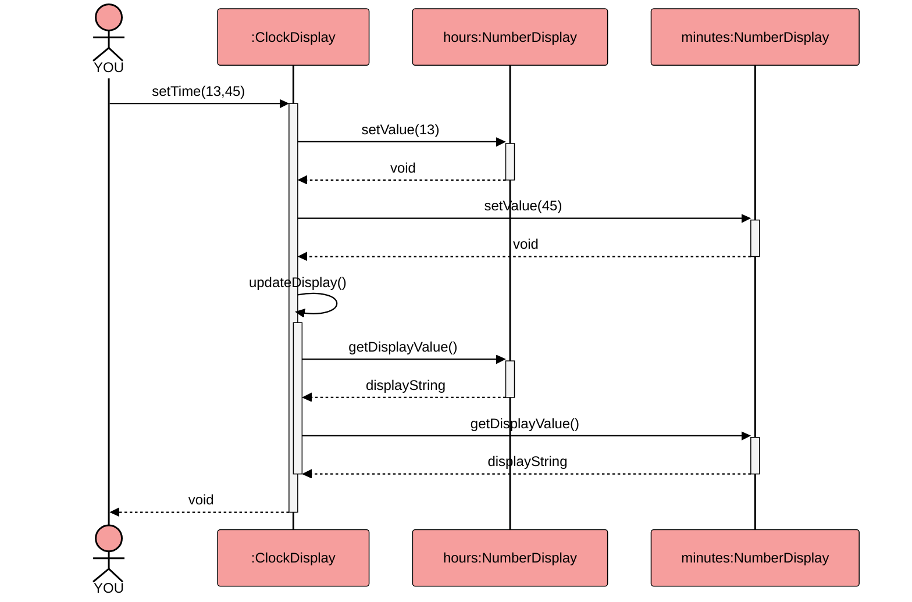
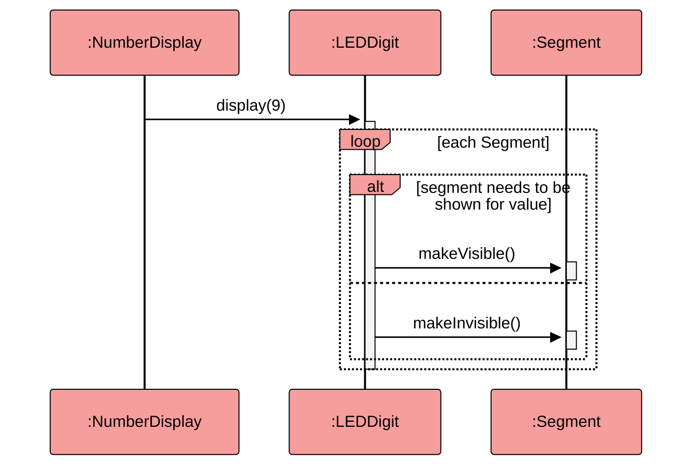
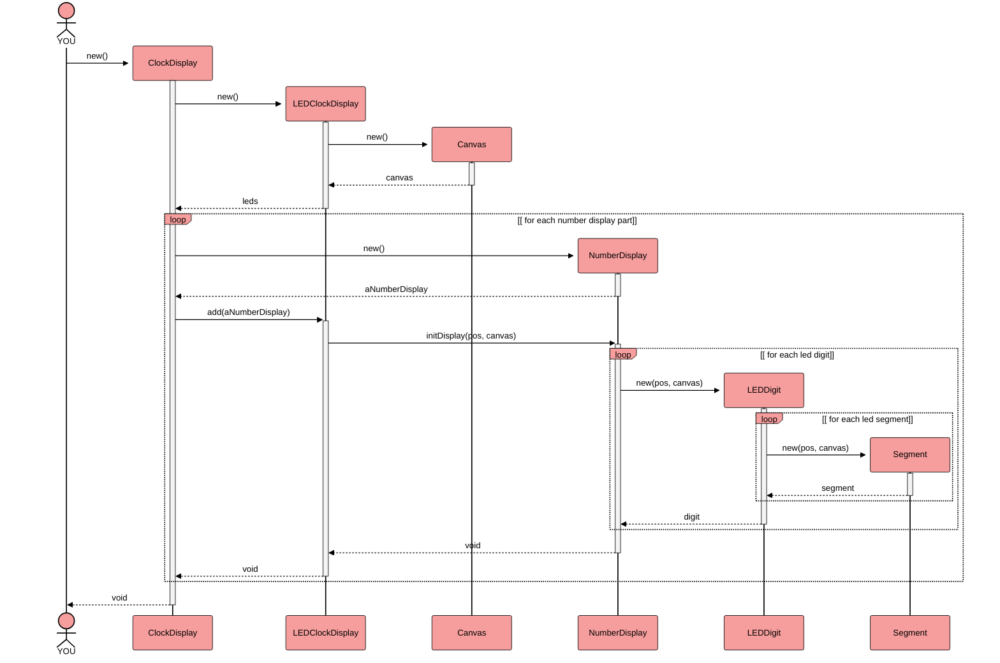



## Documentation

## LEDDisplay extends ClockDisplay

## ClockDisplay: additional methods for clock and automatic Ticker

## LEDDisplay: setTime() - complete 

## LEDDisplay: setTime() - ClockDisplay & NumberDisplay 

## LEDDisplay: setTime() - both NumberDisplays &  LEDDigit

## ClockDisplay original: setTime() copy

## LEDDisplay: setTime() NumberDisplay->LEDDigit

### Initialization (maybe old)

loop [ for each display part]