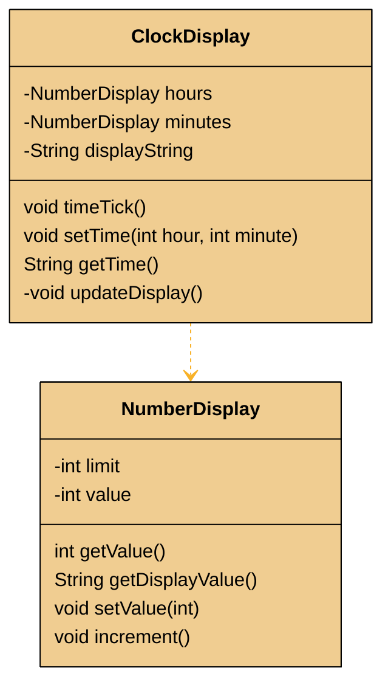
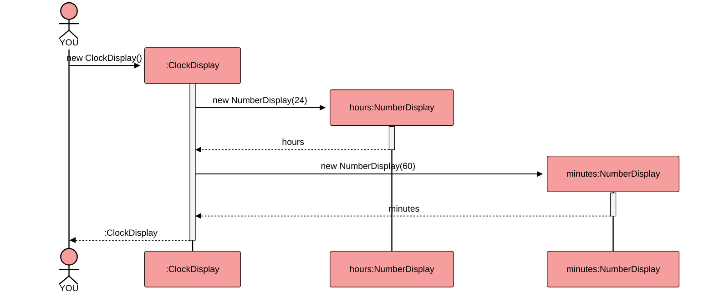
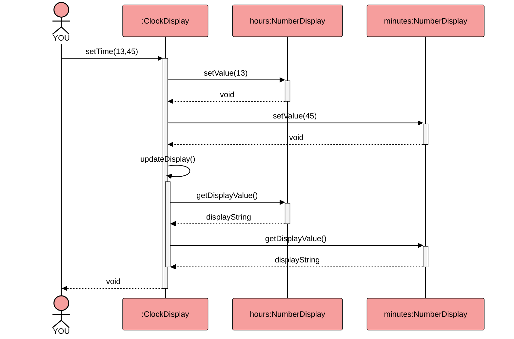
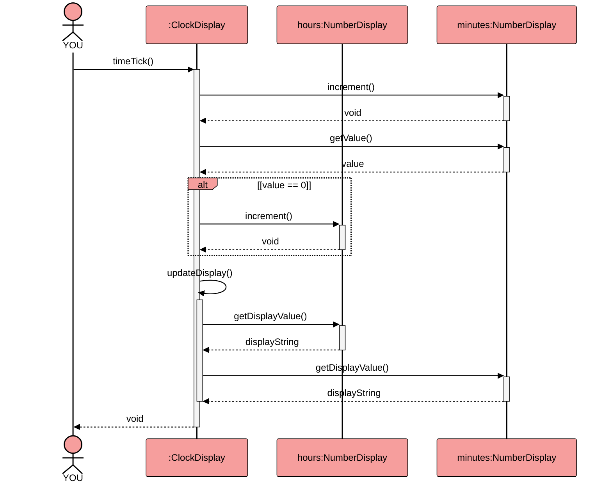
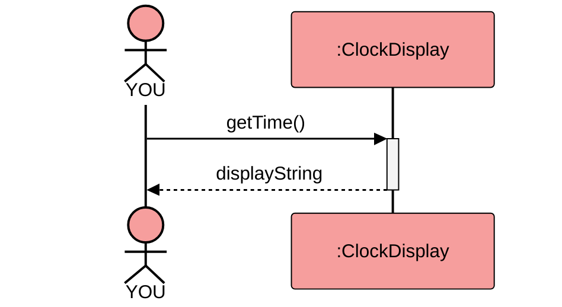



The #colon;ClockDisplay project is the first example for solving a problem using communicating objects. (in the Book ["Objects First with Java: A Practical Introduction Using Bluej." by David J Barnes and Michael Kölling][2]) 

Here's a class diagram with the private fields and public methods (Constructors are omitted for clarity):

Within the example the field `displayString` in ClockDisplay is used to simulate the digital display. It is updated after every change to the time by calling the private method `updateDisplay` after every change to the time. The two instances of NumberDisplay generate their part of the displayString in `getDisplayValue`.
But they also hold their part of the model - the value for hours and minutes respectively.

The observable behavior of this example is returning a String like "13:45" from `getTime()` after either the time has been set to 13:45 by calling `setTime()` or by calling the `tick()` method the appropriate amount of times.

## Original Version: Creation

## Original Version: setTime()

## Original Version: timeTick()

## Original Version: getTime()

[2]: https://www.bluej.org/objects-first/