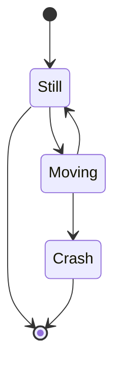
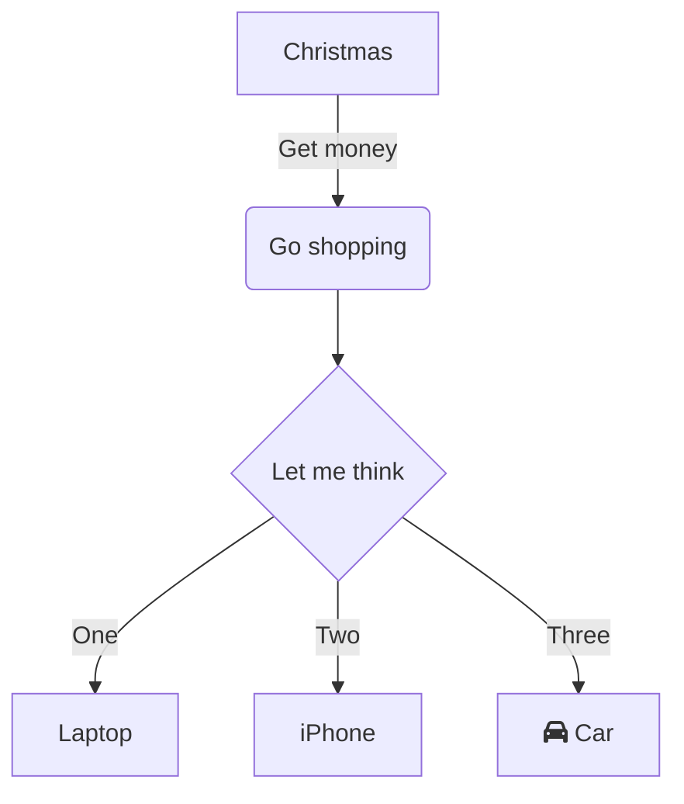

[Mermaid](https://mermaid.js.org/) renders diagrams from simple markdown code. It can be used
- via integrating the available js library (yarn add mermaid),
- online via [Mermaid-Live](https://mermaid.live/),
- is available in [Github markdown files](https://docs.github.com/en/get-started/writing-on-github/working-with-advanced-formatting/creating-diagrams) (and others)
- and can be [easily integrated into hugo](https://gohugo.io/content-management/diagrams/#mermaid-diagrams)[^1]

Here are some examples taken from Mermaid Live:




    flowchart TD
        A[Christmas] -->|Get money| B(Go shopping)
        B --> C{Let me think}
        C -->|One| D[Laptop]
        C -->|Two| E[iPhone]
        C -->|Three| F[fa:fa-car Car]



```mermaid
stateDiagram-v2
    [*] --> Still
    Still --> [*]
    Still --> Moving
    Moving --> Still
    Moving --> Crash
    Crash --> [*]
  ```

# Flowchart Cheatsheet
```mermaid
flowchart TD
    A[Start] --> B{Is it?}
    B -->|Yes| C[OK]
    C --> D[Rethink]
    D --> B
    B ---->|No| E[End]
    id1>This is the text in the box]
    id2{{This is the text in the box}}
```
[^1]: hugo/themes/greenpage/layouts/_default/_markup/