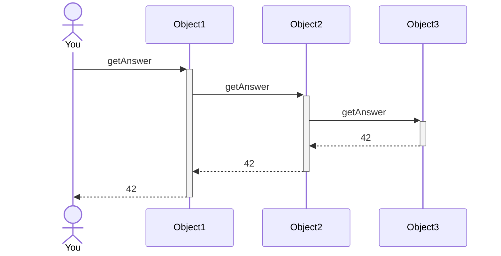
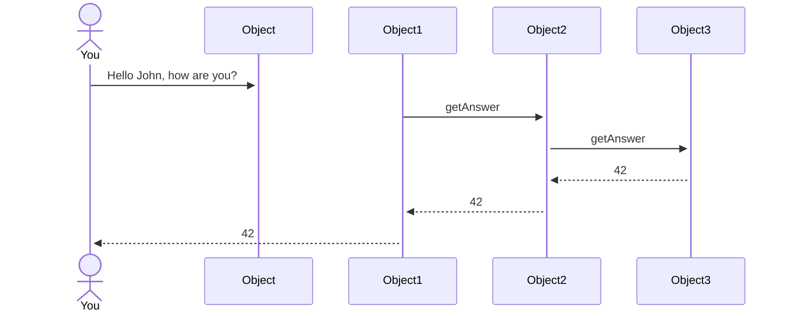
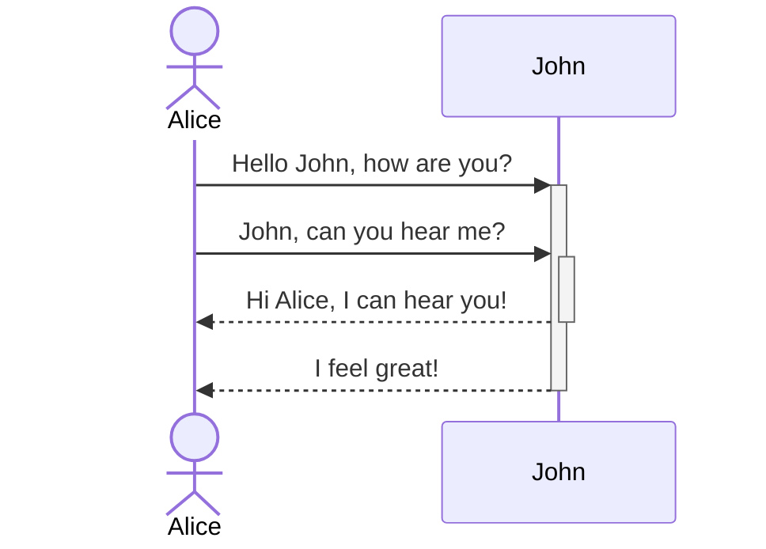
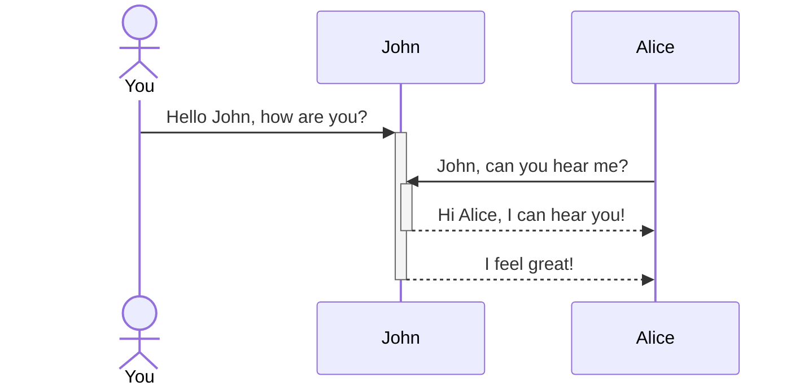
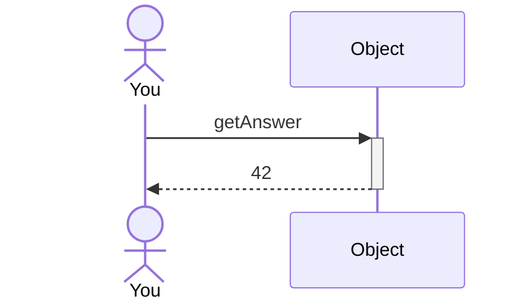

## What to bring to lab

**P1.** In the lecture we have talked about data types called int and String. Java has more predefined primitive data types. What are they? Record where you found this information.

**P2.** What are the types of the following values?

    0
    "hello"
    101
    -13
    true
    "true"
    "61"
    '7'
    3.1415

**P3.** Pick up a book—you should have at least one at home. Is it an object or a class? If it is a class, name some objects. If it is an object, name the class. Give your reasoning.

**P4.** What class does the following constructor belong to? How many formal parameters does it have? What are their types?

```java
public Book (String title, double price)
```
If you will be using your own laptop in the lab, please [install BlueJ 5.2.0 before you come to lab](https://www.bluej.org/). Downloads are available for all platforms—it's written in Java! Write once, run anywhere!

## Post-Lab, AKA  What To Turn In

Your completed assignment, submitted in Moodle as a pdf, should include:

- a description of what you did during the lab, including a record of how you got BlueJ started and how you produced the pdf
- a screenshot of your scene. How did you get a screenshot produced?
- A brief summary of what, if anything, you learned during this exercise.
- the names and roles of any collaborators in any parts of the exercise.

Lab assignments are due as shown in Moodle. They may, of course, be turned in earlier. You hand them in by preparing the report in PDF together in your group (identical file with all your names on the first page!). 
**Each member of the group submits their own copy of the report.**

## Assignment

Remember to keep a logbook where you put down what you were doing.

### 1. Figures

Download the projects file from Github:  and open up the figures project with BlueJ.

3. Create a Circle, a Triangle, a Person, and two Squares. Oops, where is the second Square? How can you make both visible on the screen?
4. Make all five figures have the same color. What did you have to do? Did you make any mistakes doing this?
5. Now make an interesting picture using at least one of each of the shapes! 
   Use at least seven objects. Record what you had to do to get your scene set up. Take a screenshot to include in your report.
6. Did you make any errors? Could you delete a mistaken object? Explain how you think this worked—or didn't work. Did anything catastrophic happen? Keep records of this in your report!
6. Now, find the draw() method in the Picture class. Try adding a second form to the picture. Call the Picture->draw() method - you've written your first Program! If you want to, put the sequence of messages recorded in 5. into this method automating the drawing of your picture.
7. (For the bored) Okay, so you've been programming since before you could talk and this is child's play. Explore a little deeper—can you make the shapes canvas larger? What happens when a figure hits the wall? How can you figure out where the wall is? Right, this is badly programmed. What would you have to do to get a shape to bounce off the wall? Can you do it?

### 2. Kara

Now we do the same with Kara - sending messages to the Kara object.

1. Open the 01-01-walk project in greenfoot.


<small class = "float-right">Screenshot Greenfoot</small>


### Writeup

You will be doing your writeup at home. Use the notes that you took in your logbook. Submit your writeup as your post-lab to the Moodle area.