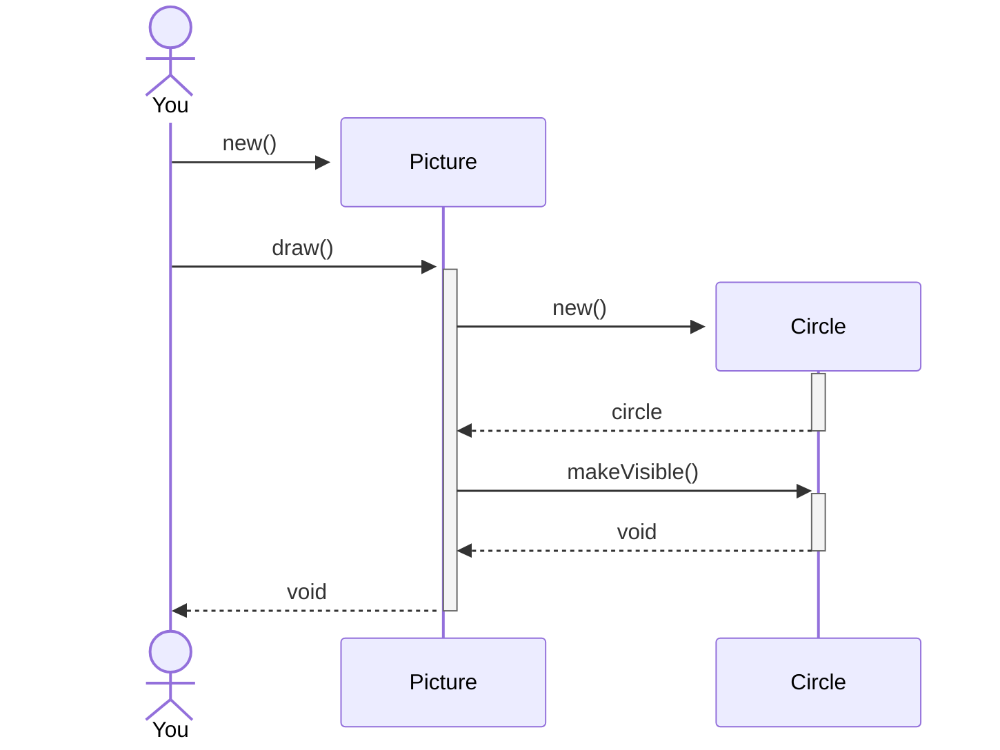

This week's lab is all about exploring given Objects by sending them messages (aka in Java: calling methods) - 
and writing your first programs by putting them together in your own methods.
## What to bring to lab

**P1.** In the lecture we have talked about data types called int and String. Java has more predefined primitive data types. What are they? Record where you found this information.

**P2.** What are the types of the following values?

    0
    "hello"
    101
    -13
    true
    "true"
    "61"
    '7'
    3.1415

**P3.** Pick up a book—you should have at least one at home. Is it an object or a class? If it is a class, name some objects. If it is an object, name the class. Give your reasoning.

**P4.** Consider the Car example we did in class. (You'll find it in the slides.) The examples shows two attributes of cars, color and location.
collect some more attributes that would make sense for cars. Which of them will stay the same over a car's lifetime and which of them will probably change? (If you don't like cars, feel free to do the same for Bicycles).

**P4.** What class does the following constructor (signature) belong to? How many formal parameters does it have? What are their types?

```java
public Student(String fullName, String studentID)
```
If you will be using your own laptop in the lab, please [install BlueJ 5.2.0](https://www.bluej.org/) and [Greenfoot 3.8.0](https://www.greenfoot.org/download) before you come to lab. Downloads are available for all platforms—it's written in Java! Write once, run anywhere! 
More Info on how to work in the Lab can be found in [last week's startup exercise](../exercise-00), which was part of the Erstis-Introduction.

## Post-Lab, AKA  What To Turn In

Your completed assignment, submitted in Moodle as a pdf, should include:

- a description of what you did during the lab, including a record of how you got BlueJ and Greenfoot started and how you produced the pdf
- a screenshot of your scene. How did you get a screenshot produced?
- A brief summary of what, if anything, you learned during this exercise.
- the names and roles of any collaborators in any parts of the exercise.

Lab assignments are due as shown in Moodle. They may, of course, be turned in earlier. You hand them in by preparing the report in PDF together in your group (identical file with all your names on the first page!). 
**Each member of the group submits their own copy of the report.**

## Assignment

Remember to keep a logbook where you put down what you were doing.

### 1. Figures, House and Picture

Download the source code for chapter 1 (if you haven't already done so) from Github:  

#### 1. In the figures project:
1. Create a Circle, a Square, a Triangle, and two Persons. 
   Oops, where is the second Person? How can you make both visible on the screen?
2. Try out some more methods on the Figures. You are sending messages to objects!


#### 2. In the house project:
1. Create a Picture and call its draw() method.
2. Now, find the draw() method in the Picture class. What does it do?
3. Try to add a person to the Picture.
4. Alter the draw() method to modify your picture as you like, including the Person. 


### 2. Lab Class List

By now, you have probably experienced that the objects in your Object Bench disappear whenever the Java Runtime is re-started.
Objects are created dynamically by the program. They are not persistent. [There's a trick to store your object bench, however.](/material/info1/save_object_bench/)

Open the lab-class project.

#### 1. Explore the Project a bit:
0. Enable Recording in the Terminal: View-> Show Terminal, in the Terminal Menu: Options->Record Method Calls
1. create an Instance of Student.
2. create an Instance of LabClass.
3. enroll the Student in the Class by calling `enrollStudent(Student newStudent)`. You need to provide an instance of class Student as a parameter. You can do so by either typing the 
instance name or just double-clicking on the object in the workbench.
4. call `printList()` on LabClass
#### 2. Use LabClass to print a list of your Group: 
Complete the `createGroup()` method in `Info1LabGroup`: it should create a LabClass with Student objects for each of you (in your Lab Group) in it.
Using Terminal Recording, you can record the calls you made interactively in BlueJ and put the program together by copying them. 

You do not need to examine or change the code of the other classes! 
        
1. create an instance of LabClass. don't forget to set all attributes!
1. create an instances of `Student` for each member of your group as you work together on the exercise.  Don't forget to add the pronouns they use by using `setPronouns()`.
3. enroll the students in the class 
4. call `printList()` on LabClass and check wether all information is complete. 

Add a screenshot of your `createGroup()` method and the printout to your lab report. 
### 3. Kara

Now we do the same with Kara - sending messages to the Kara object, and then putting them together to write little programs.

#### 1. Square-Drop

1. Open the [01-04-square-drop](https://github.com/htw-imi-info1/chapter01/tree/main/kara/01-04-square-drop) project with Greenfoot.
2. create an instance of the `Kara` class (the gray Kara).
3. This class implements all of Kara's special methods. call it's `move()` method, and try out some more methods.

      

 2. Now, get back to the `MyKara` instance (the red Kara). It inherits all methods from its super class `Kara` (as well as from `Kara`´s super class `Actor` and its superclass `Object`) - thus, you find the Kara methods in the submenu "inherited from Kara".
 
 

 5. make MyKara walk 4 fields forward and then turn right. Put this in it's act() method!
 6. now, click on act() several times.
 7. click on run. This will call act() in an indefinite loop.
 8. Put a Leaf in each corner. What happens after the fourth call to act()? Explain in your report.
 8. (Challenge) - can you figure out how to make it stop after one round? 

### 2. Around Tree

1. open the [01-05-aroundTree](https://github.com/htw-imi-info1/chapter01/tree/mainkara/01-05-aroundTree) project in Greenfoot.
2. make Kara walk around the tree by adding the necessary method calls to the act()method.

Include Screenshots of your completed act() methods in your report.


### Writeup

You will be doing your writeup at home. Use the notes that you took in your logbook. 
Submit your lab report to the Moodle area.