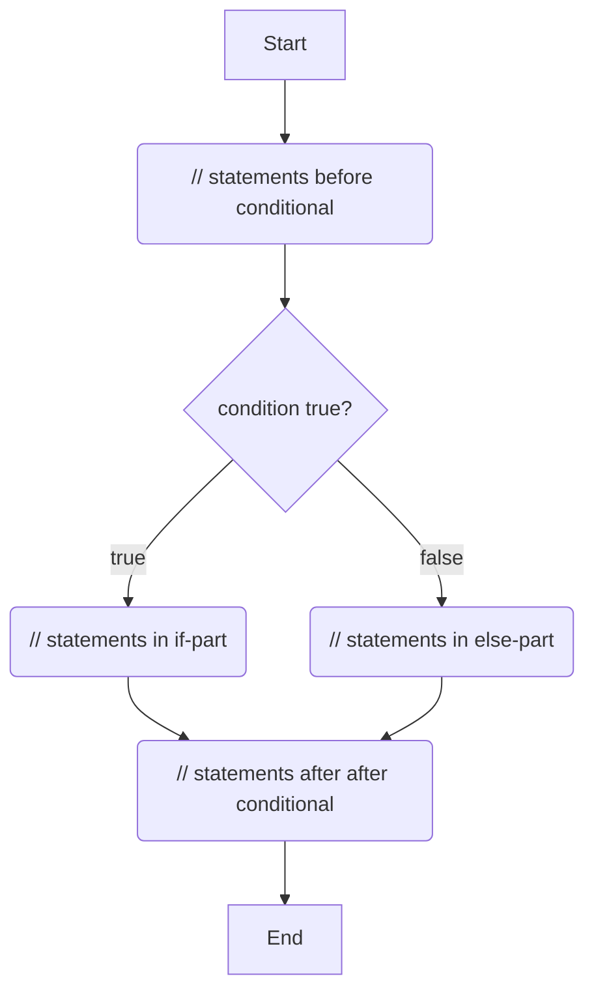

https://docs.oracle.com/javase/tutorial/java/nutsandbolts/if.html

```java

// statements before conditional

if(condition){
    // statements in if-part
} else {
    // statements in else-part
}

// statements after after conditional
```


