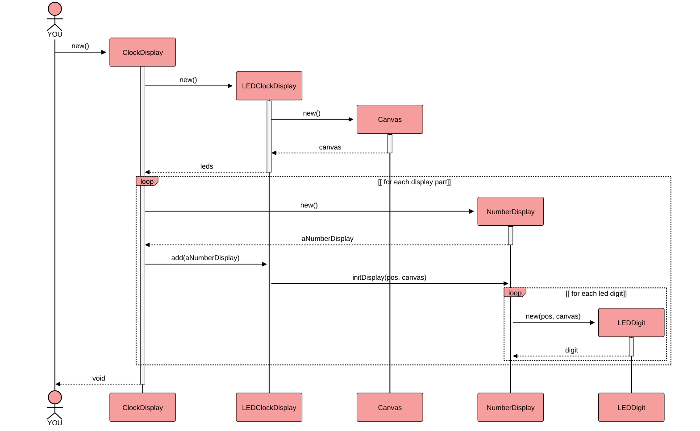

## Documentation

### Initialization

```mermaid
%%{
  init: {
    'theme': 'base',
    'themeVariables': {
      'primaryColor': '#f69e9d', 
      'primaryTextColor': '#000',
      'primaryBorderColor': '#000',
      'lineColor': '#F8B229',
      'secondaryColor': '#f4f4f4',
      'activationBorderColor': '#000',
      'tertiaryColor': '#fff'
    }
  }
}%%
sequenceDiagram
    actor YOU
    create participant ClockDisplay
    YOU->>+ClockDisplay: new()

    create participant LEDClockDisplay
    ClockDisplay->>+LEDClockDisplay: new()
    create participant Canvas
    LEDClockDisplay->>+Canvas: new()
    Canvas-->>-LEDClockDisplay: canvas
    LEDClockDisplay-->>-ClockDisplay: leds

    loop [ for each display part]
    create participant NumberDisplay
    ClockDisplay->>+NumberDisplay:new()
    NumberDisplay-->>-ClockDisplay:aNumberDisplay
    ClockDisplay->>+LEDClockDisplay: add(aNumberDisplay)
    LEDClockDisplay->>+NumberDisplay:initDisplay(pos, canvas)
    
    loop [ for each led digit]
    create participant LEDDigit
    NumberDisplay->>+LEDDigit:new(pos, canvas)
    LEDDigit-->>-NumberDisplay: digit
    end
    


    end

    ClockDisplay-->>-YOU:void


```

loop [ for each display part]