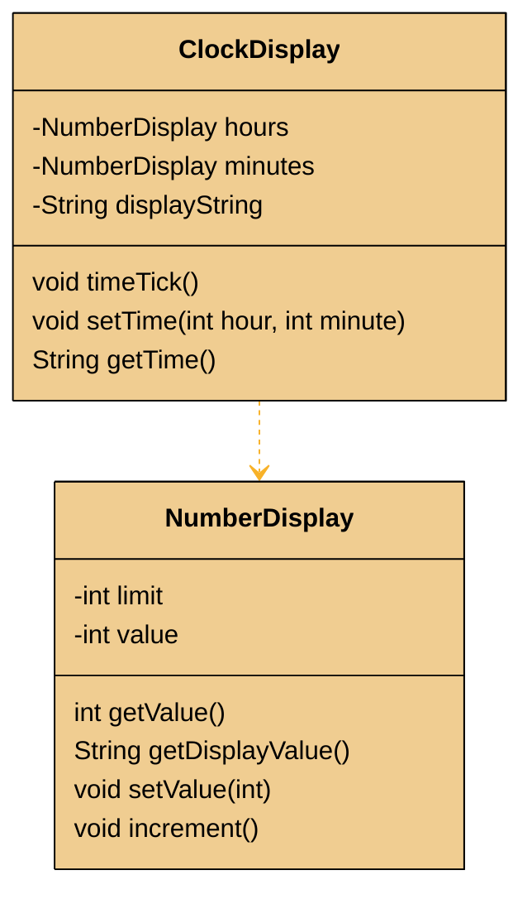
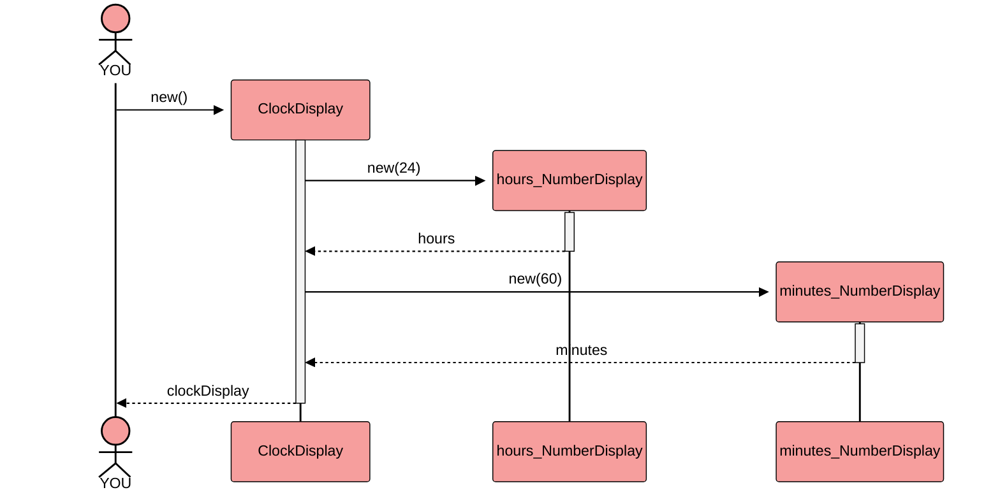
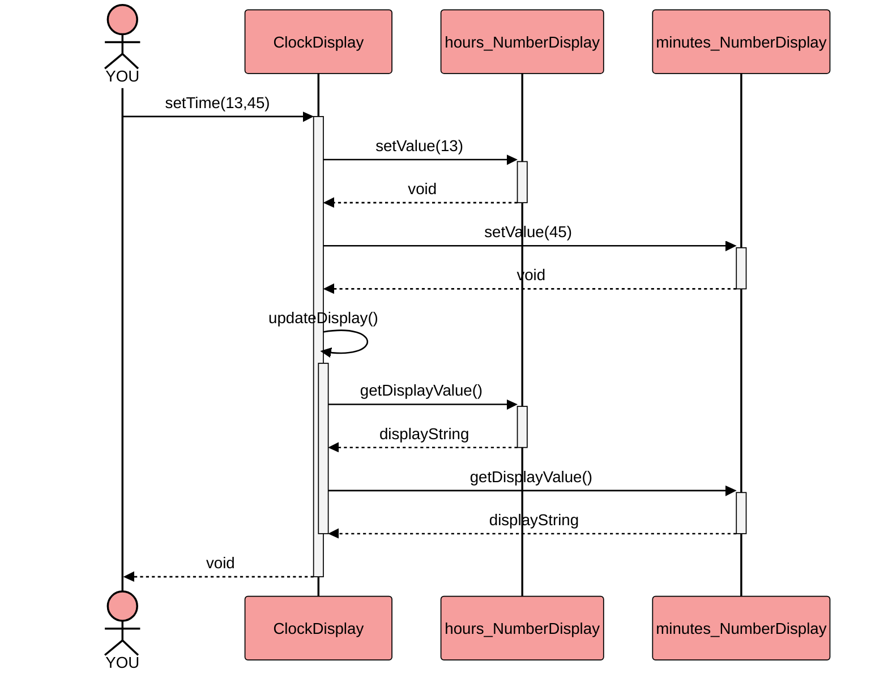
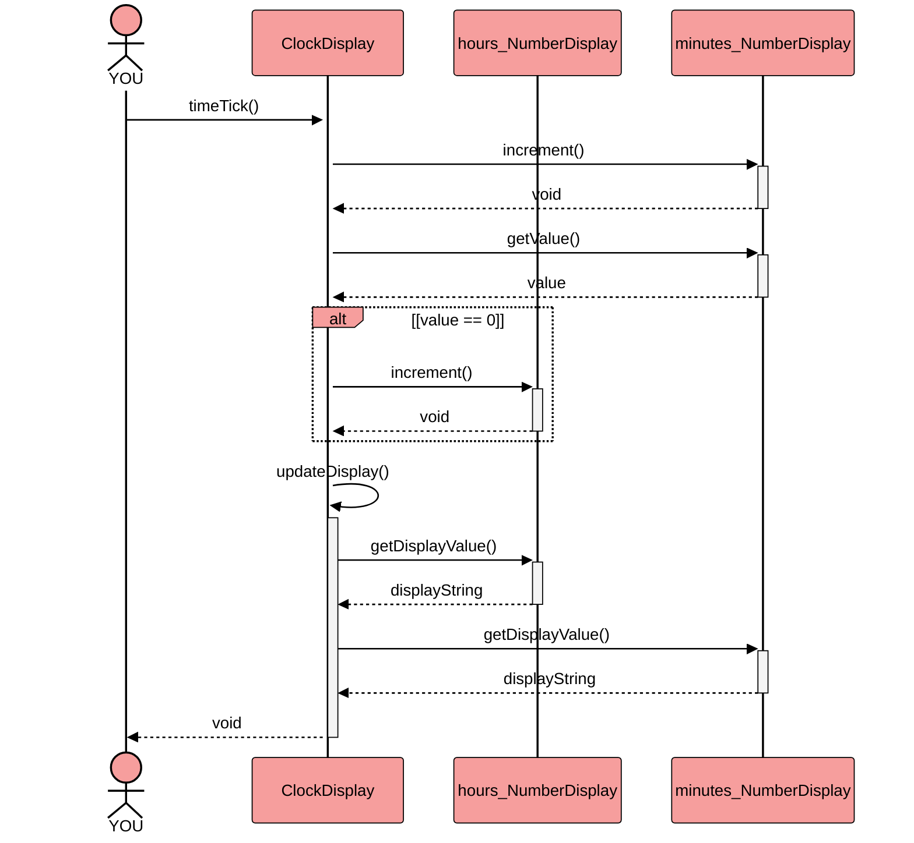

The ClockDisplay project is used in the Book ...TBD ad the first example for modularizing a program 
using communicating objects.

Here's a class diagram with the private fields and public methods (Constructors are omitted for clarity):

All this example really does is returning a String like "13:45" from `getTime()`  after either the time has been set to 13:45 by calling `setTime()` or by calling the `tick()` method the appropriate amount of times.

The Interface is in `ClockDisplay`, `NumberDisplay` is an implementation detail.

This makes the program way simpler:

## Original Version: Creation

## Original Version: setTime()

## Original Version: timeTick()

