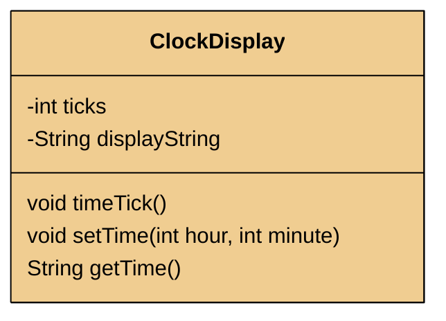
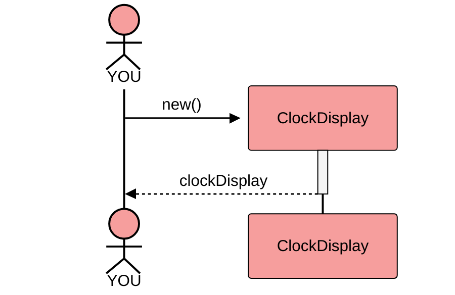
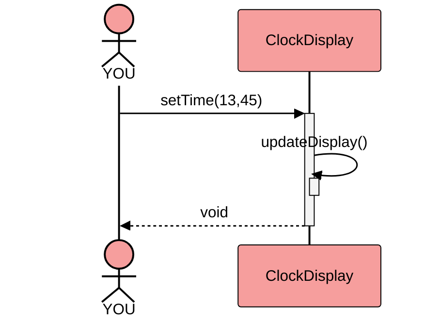
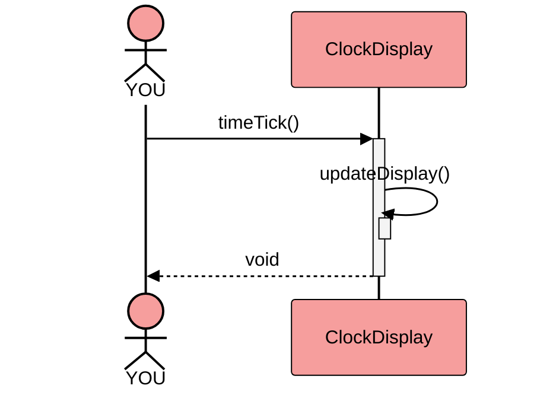

All the ClockDisplay example really does is returning a String like "13:45" from `getTime()`  after either the time has been set to 13:45 by calling `setTime()` or after calling the `timeTick()` method the appropriate amount of times.

This can, of course, be implemented in a much simpler way. This is most probably true for most of the small examples we use in Programming and Software Engineering classes.
But I feel that is has gone wrong with this one, because the combination of pointlessness with overcomplication 
does not help students understand the concept of modularization to small communicating objects.

The Interface is in `ClockDisplay`, `NumberDisplay` is an implementation detail.

The Interface of `ClockDisplay` consists of three methods, as can be seen in the BlueJ menu:

Here's a much simpler and shorter implementation of this Interface:

## Simple Version: Class Diagram

## Simple Version: Creation

## Simple Version: setTime()

## Simple Version: timeTick()

This example can no longer be used to show Object interaction. It only shows an object calling its own method (`updateDisplay()`) and how to use a modulo operator.

